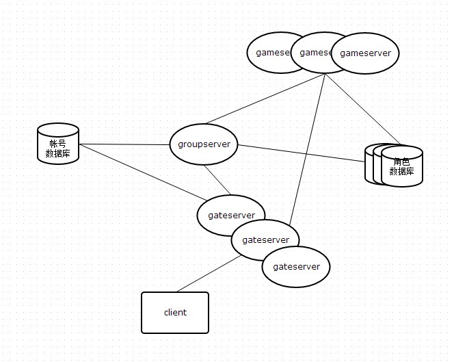
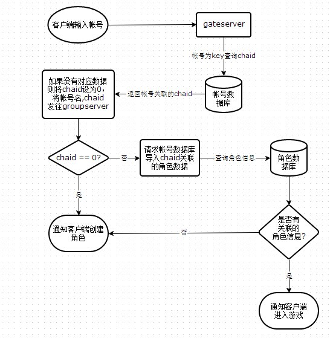
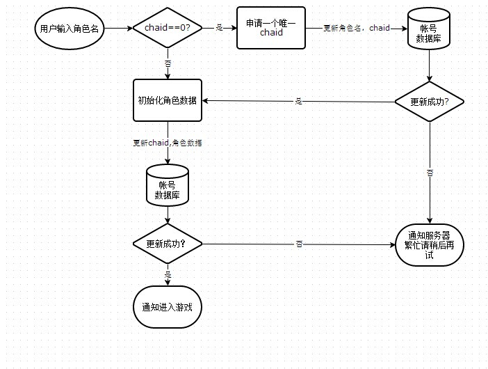
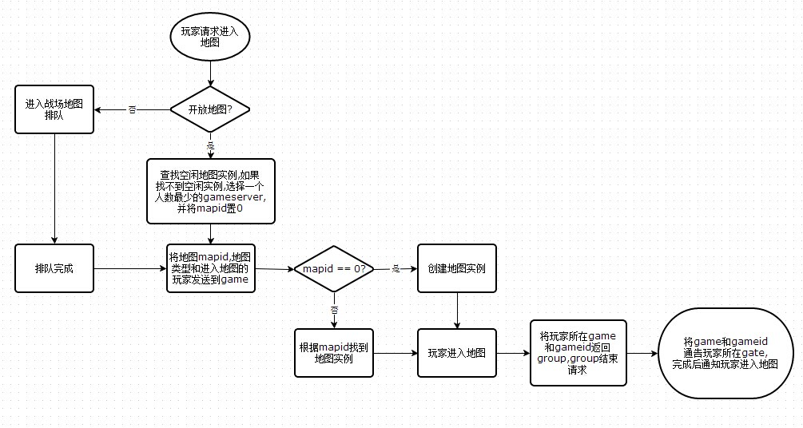

##小型手游服务器

服务器采用C+lua的方式开发.除效率要求高和lua无法实现的部分由C实现外，所有逻辑功能由lua实现.

服务器组结构图:

图中所有连接线均表示tcp长连接.

gateserver:前端连接服务器,可部署多台.负责将玩家的通讯消息转发到内部服务器组/将内部服务器组的消息发往玩家.

groupserver:中心服务器,只有一台.主要负责管理整个服务器组以及处理游戏的全局逻辑.

gameserver:战斗及地图服务.负责玩家在游戏场景中的移动，战斗等逻辑.单线程,每个服务上可以加载1-n个场景.

数据库:数据库采用redis/ssdb。分为两个主要的功能数据库(帐号数据库,角色数据库),其中帐号数据库唯一,保存的数据是
帐号,角色id对,角色数据库可部署多个,通过角色id做hash将角色数据分布到不同的角色数据库中.

###移动同步

服务器和客户端均使用网格寻路,服务器和客户端共享同样的寻路网格。为了减少同步移动消息产生的流量.

当客户端请求移动时，将移动请求的目标点发送服务器,由服务器计算出路径.假如路径存在则将这个请求广播给可视客户端.客户端收到请求后,在本地计算路径信息并执行移动.服务器中,有一个定时器以固定的间隔根据路径移动服务器对象,以保证服务器对象的坐标与客户端的对象坐标大体保持一致.如果前一次移动尚未到达目的地，客户端发出新的一次请求，则服务器会丢弃当前路径，并计算新的路径去移动.

###消息广播处理

当groupserver/gameserver要向多个玩家对象发送同一个消息时.将接收消息对象的gateid添加到消息尾部发送给gateserver。gateserver收到消息后根据尾部消息构建一个接收者列表，然后丢弃尾部的额外数据.之后遍历接收者列表将消息发送给它.

###登陆流程

###角色创建流程

###玩家进入地图处理

